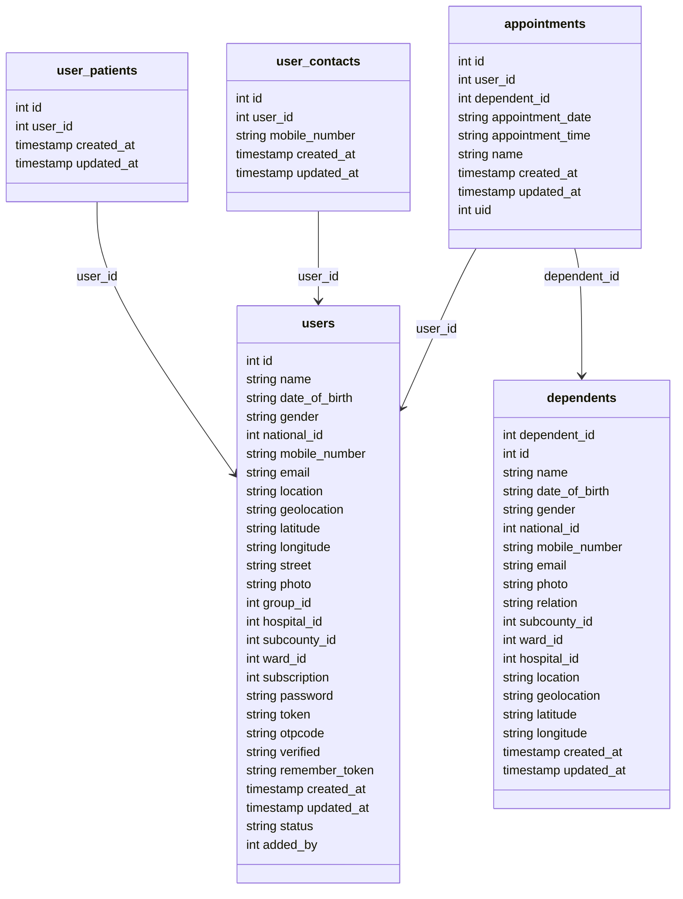
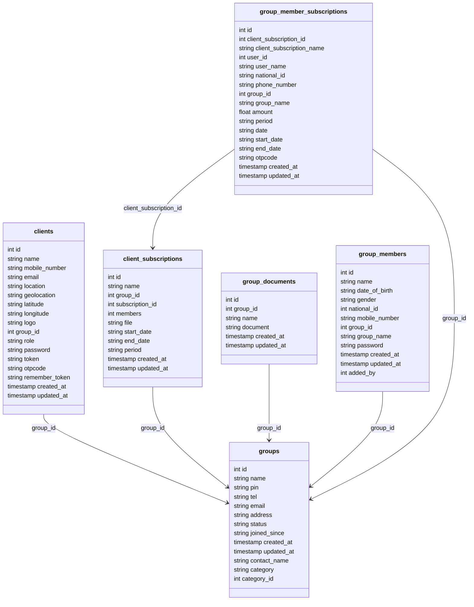
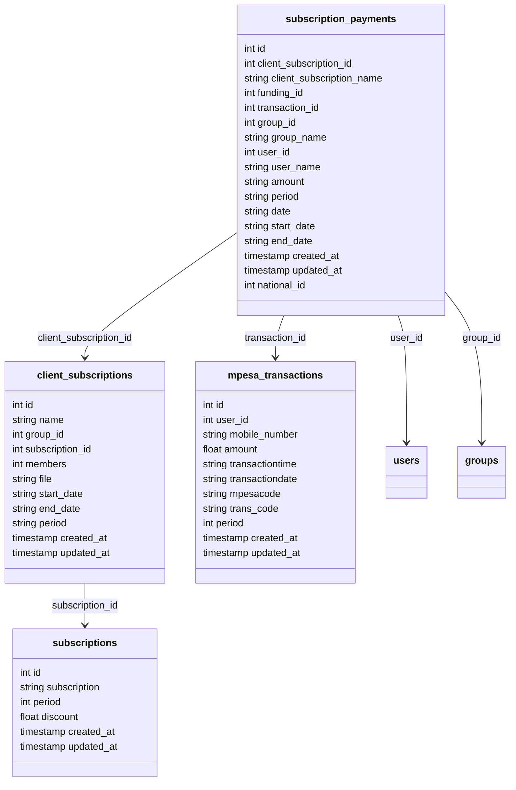
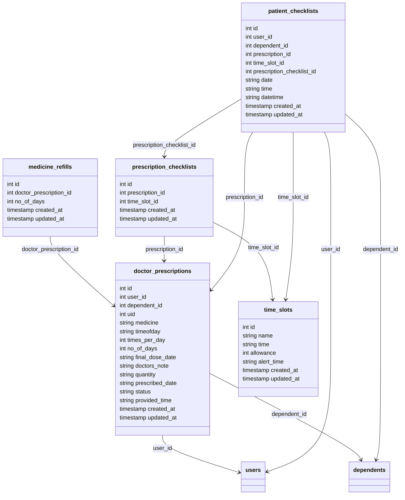
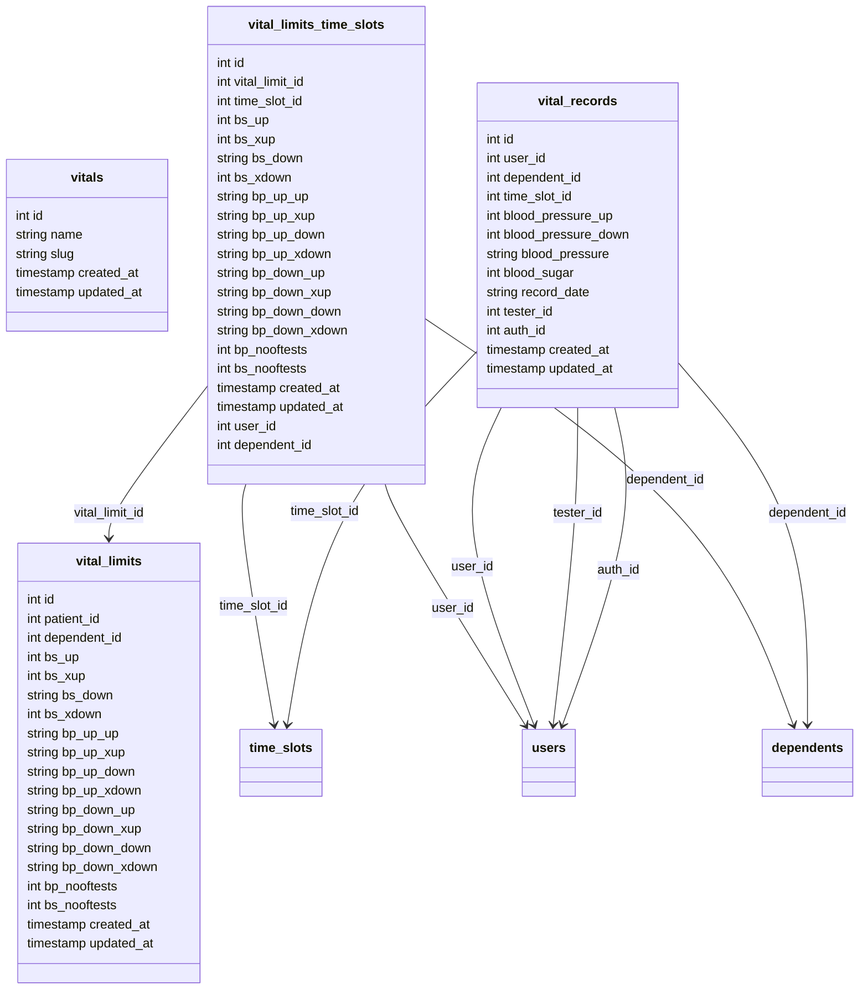

# 📘 Halistawi Health Application – Class Diagrams

---

## Appointments and Users

```mermaid
classDiagram

class appointments {
  int id
  int user_id
  int dependent_id
  string appointment_date
  string appointment_time
  string name
  timestamp created_at
  timestamp updated_at
  int uid
}

class users {
  int id
  string name
  string date_of_birth
  string gender
  int national_id
  string mobile_number
  string email
  string location
  string geolocation
  string latitude
  string longitude
  string street
  string photo
  int group_id
  int hospital_id
  int subcounty_id
  int ward_id
  int subscription
  string password
  string token
  string otpcode
  string verified
  string remember_token
  timestamp created_at
  timestamp updated_at
  string status
  int added_by
}

class dependents {
  int dependent_id
  int id
  string name
  string date_of_birth
  string gender
  int national_id
  string mobile_number
  string email
  string photo
  string relation
  int subcounty_id
  int ward_id
  int hospital_id
  string location
  string geolocation
  string latitude
  string longitude
  timestamp created_at
  timestamp updated_at
}

class user_contacts {
  int id
  int user_id
  string mobile_number
  timestamp created_at
  timestamp updated_at
}

class user_patients {
  int id
  int user_id
  timestamp created_at
  timestamp updated_at
}

appointments --> users : user_id
appointments --> dependents : dependent_id
user_contacts --> users : user_id
user_patients --> users : user_id
```
## Groups and Clients

```mermaid
classDiagram

class clients {
  int id
  string name
  string mobile_number
  string email
  string location
  string geolocation
  string latitude
  string longitude
  string logo
  int group_id
  string role
  string password
  string token
  string otpcode
  string remember_token
  timestamp created_at
  timestamp updated_at
}

class groups {
  int id
  string name
  string pin
  string tel
  string email
  string address
  string status
  string joined_since
  timestamp created_at
  timestamp updated_at
  string contact_name
  string category
  int category_id
}

class group_documents {
  int id
  int group_id
  string name
  string document
  timestamp created_at
  timestamp updated_at
}

class group_members {
  int id
  string name
  string date_of_birth
  string gender
  int national_id
  string mobile_number
  int group_id
  string group_name
  string password
  timestamp created_at
  timestamp updated_at
  int added_by
}

class group_member_subscriptions {
  int id
  int client_subscription_id
  string client_subscription_name
  int user_id
  string user_name
  string national_id
  string phone_number
  int group_id
  string group_name
  float amount
  string period
  string date
  string start_date
  string end_date
  string otpcode
  timestamp created_at
  timestamp updated_at
}

class client_subscriptions {
  int id
  string name
  int group_id
  int subscription_id
  int members
  string file
  string start_date
  string end_date
  string period
  timestamp created_at
  timestamp updated_at
}

clients --> groups : group_id
client_subscriptions --> groups : group_id
group_documents --> groups : group_id
group_members --> groups : group_id
group_member_subscriptions --> client_subscriptions : client_subscription_id
group_member_subscriptions --> groups : group_id
```
## Subscriptions and Payments

```mermaid
classDiagram

class subscriptions {
  int id
  string subscription
  int period
  float discount
  timestamp created_at
  timestamp updated_at
}

class client_subscriptions {
  int id
  string name
  int group_id
  int subscription_id
  int members
  string file
  string start_date
  string end_date
  string period
  timestamp created_at
  timestamp updated_at
}

class subscription_payments {
  int id
  int client_subscription_id
  string client_subscription_name
  int funding_id
  int transaction_id
  int group_id
  string group_name
  int user_id
  string user_name
  string amount
  string period
  string date
  string start_date
  string end_date
  timestamp created_at
  timestamp updated_at
  int national_id
}

class mpesa_transactions {
  int id
  int user_id
  string mobile_number
  float amount
  string transactiontime
  string transactiondate
  string mpesacode
  string trans_code
  int period
  timestamp created_at
  timestamp updated_at
}

client_subscriptions --> subscriptions : subscription_id
subscription_payments --> client_subscriptions : client_subscription_id
subscription_payments --> mpesa_transactions : transaction_id
subscription_payments --> users : user_id
subscription_payments --> groups : group_id
```

## Prescriptions and Checklists

```mermaid
classDiagram

class doctor_prescriptions {
  int id
  int user_id
  int dependent_id
  int uid
  string medicine
  string timeofday
  int times_per_day
  int no_of_days
  string final_dose_date
  string doctors_note
  string quantity
  string prescribed_date
  string status
  string provided_time
  timestamp created_at
  timestamp updated_at
}

class prescription_checklists {
  int id
  int prescription_id
  int time_slot_id
  timestamp created_at
  timestamp updated_at
}

class patient_checklists {
  int id
  int user_id
  int dependent_id
  int prescription_id
  int time_slot_id
  int prescription_checklist_id
  string date
  string time
  string datetime
  timestamp created_at
  timestamp updated_at
}

class medicine_refills {
  int id
  int doctor_prescription_id
  int no_of_days
  timestamp created_at
  timestamp updated_at
}

class time_slots {
  int id
  string name
  string time
  int allowance
  string alert_time
  timestamp created_at
  timestamp updated_at
}

doctor_prescriptions --> users : user_id
doctor_prescriptions --> dependents : dependent_id
medicine_refills --> doctor_prescriptions : doctor_prescription_id
prescription_checklists --> doctor_prescriptions : prescription_id
prescription_checklists --> time_slots : time_slot_id
patient_checklists --> users : user_id
patient_checklists --> dependents : dependent_id
patient_checklists --> doctor_prescriptions : prescription_id
patient_checklists --> time_slots : time_slot_id
patient_checklists --> prescription_checklists : prescription_checklist_id
```
## Vitals and Limits

```mermaid
classDiagram

class vitals {
  int id
  string name
  string slug
  timestamp created_at
  timestamp updated_at
}

class vital_limits {
  int id
  int patient_id
  int dependent_id
  int bs_up
  int bs_xup
  string bs_down
  int bs_xdown
  string bp_up_up
  string bp_up_xup
  string bp_up_down
  string bp_up_xdown
  string bp_down_up
  string bp_down_xup
  string bp_down_down
  string bp_down_xdown
  int bp_nooftests
  int bs_nooftests
  timestamp created_at
  timestamp updated_at
}

class vital_limits_time_slots {
  int id
  int vital_limit_id
  int time_slot_id
  int bs_up
  int bs_xup
  string bs_down
  int bs_xdown
  string bp_up_up
  string bp_up_xup
  string bp_up_down
  string bp_up_xdown
  string bp_down_up
  string bp_down_xup
  string bp_down_down
  string bp_down_xdown
  int bp_nooftests
  int bs_nooftests
  timestamp created_at
  timestamp updated_at
  int user_id
  int dependent_id
}

class vital_records {
  int id
  int user_id
  int dependent_id
  int time_slot_id
  int blood_pressure_up
  int blood_pressure_down
  string blood_pressure
  int blood_sugar
  string record_date
  int tester_id
  int auth_id
  timestamp created_at
  timestamp updated_at
}

vital_limits_time_slots --> vital_limits : vital_limit_id
vital_limits_time_slots --> time_slots : time_slot_id
vital_limits_time_slots --> users : user_id
vital_limits_time_slots --> dependents : dependent_id
vital_records --> users : user_id
vital_records --> dependents : dependent_id
vital_records --> time_slots : time_slot_id
vital_records --> users : tester_id
vital_records --> users : auth_id
```

