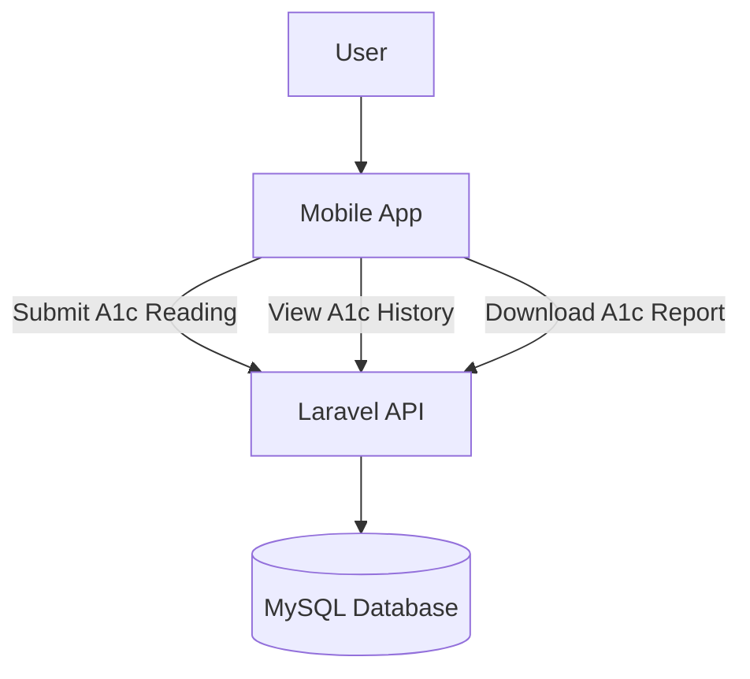
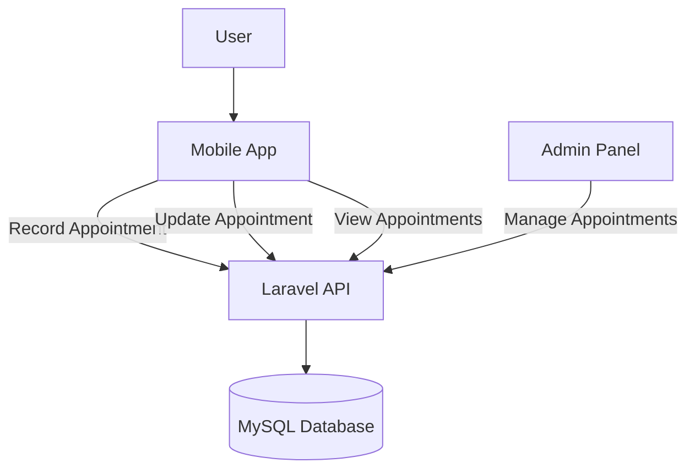
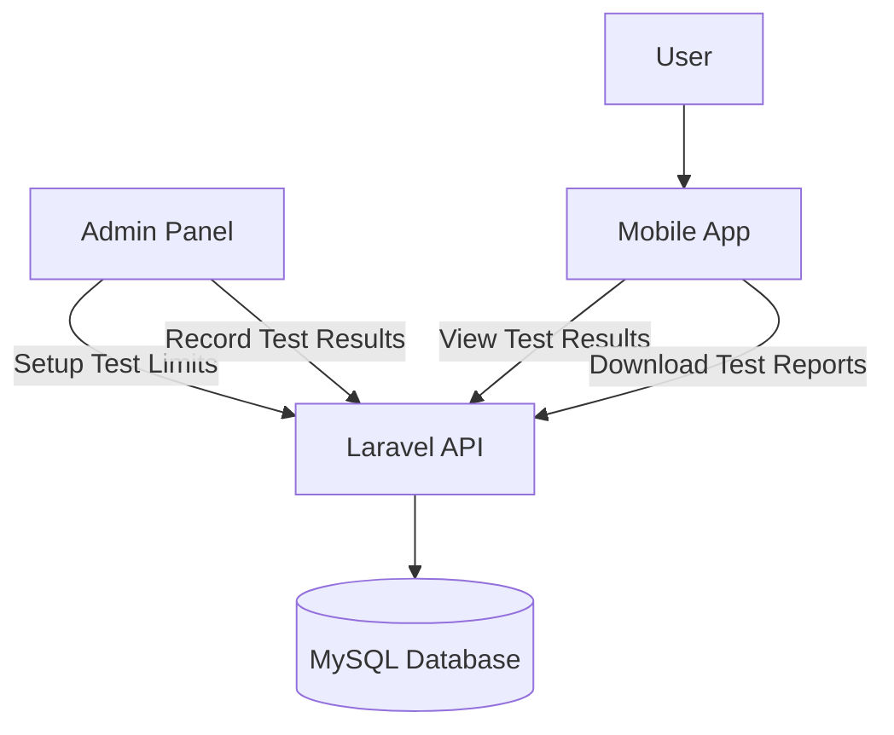
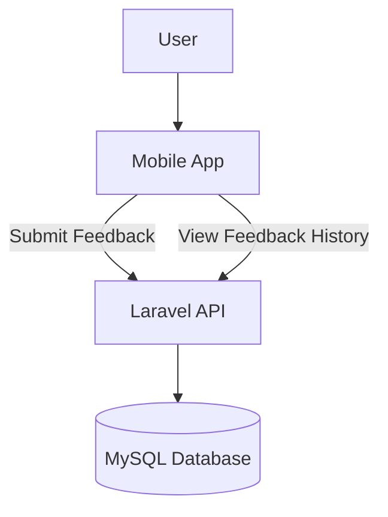
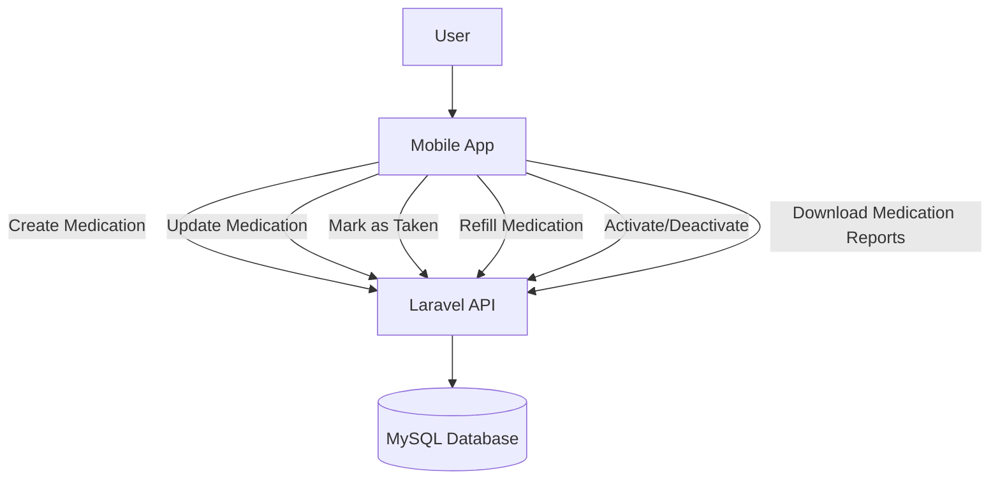
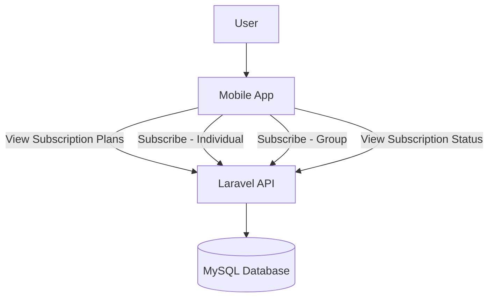

# 📘 Halistawi Health Application – Level 2 Data Flow Diagrams

This document contains detailed **Level 2 Data Flow Diagrams (DFD)** for each major module of the Halistawi application. These diagrams represent the internal interactions between the user interface, backend services (Laravel API), and the database (MySQL).

---

## 📊 A1c Module

---

## 📅 Appointments Module

---

## 🧪 Test Results Module

---

## 💬 Feedback Module

---

## 💊 Medication Module

---

## 💳 Subscriptions Module

---
